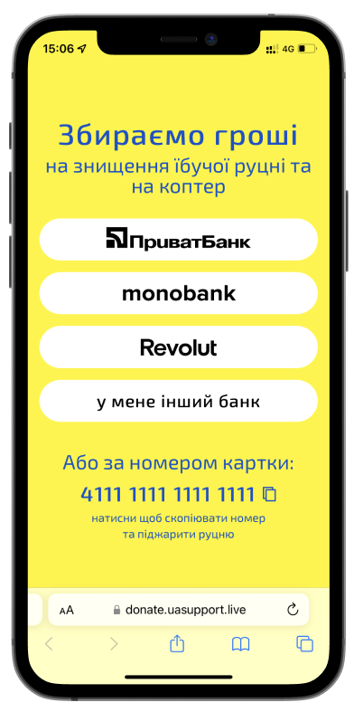
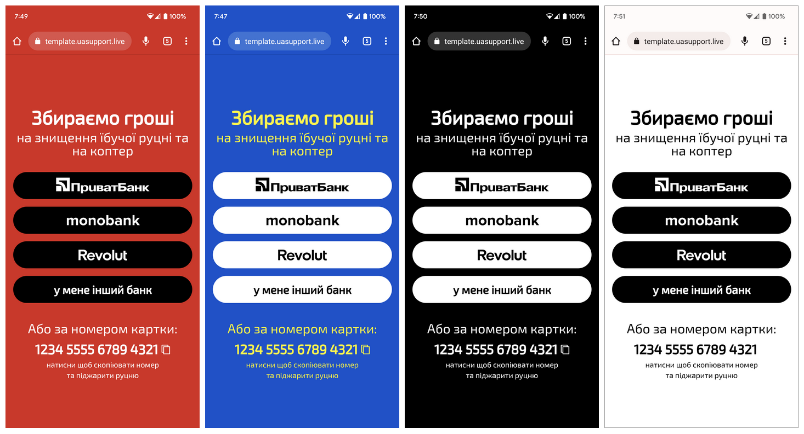

# Шаблон сторінки для донатів

Демо - https://template.uasupport.live

## Призначення
Зручная локанічна сторінка із основними варіантами доната.\
Лінку на таку сторінку зручно постити в соціальніх мережах та шерити у чатах.

## Особливості:
- Підтримка різних способів донату
- Мобайл френдлі
- Сінгл пейдж та респонсів
- Жодної залежності
- Палить руцню
- Підтримка тем

## Як це працює
- Пишете коротку тезу стосовно зборів, наприклад - `На дрон и такмед для підрозділу 029`
- Підставляєте посилання на банківські рахунки, на які ведуться збори
- Вказуєте актуальний номер банківської картки
- Розміщуєте сторінку на будь-якому сервері або за допомогою сервіса github pages

## У мене лапки
Якщо ви хочете зробити собі таку сторінку, але не розумієте як, звертайтесь до нас. Ми надамо технічну допомогу з **безкоштовним** розгортанням сторінки та розміщенню її на будь-якому піддомені типу 
`https://_yourname_.uasupport.live`\
Щоб отримати допомогу напишіть у приватні повідомнення на [facebook](https://www.facebook.com/profile.php?id=100005431693225) або [instagram](https://www.instagram.com/what_if_alina_could_cook/).

## Вільне використання
Якщо Ви волонтер, та збираєте гроші на потреби Збройних Сил України, Територіальної Оборони або для допомоги цивільному населенню, то можете користуватись шаблоном абсолютно вільно без будь-якого посилання на авторів.

## Автори та авторки
Ідея та розробка - [Сергій Вдоварейзе](https://github.com/SergiiVdovareize)\
Дизайн - [Аліна Хабачова](https://alinakhabachova.com)\
Верстка - [Антон Клижка](https://github.com/klyzhka)\
 \
 \
*Інструкція [наросійській](README.orc.md)*

---
## 💛 Support Ukraine 💙

